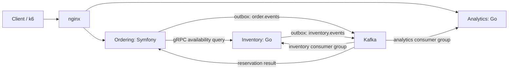

# Ordering Lab: Incremental Development Roadmap

Status: direction approved on 2026-10-08; functional implementation is deferred.

This is a roadmap, not a request to implement the whole system. Select one task
in a separate session, implement it, verify it, understand the result, and only
then commit/push when explicitly requested. The owner may implement a task
personally or ask an agent for help. Never advance automatically.

## Goal and boundaries

Build a reproducible backend engineering portfolio around order processing and
inventory reservations. Demonstrate justified service boundaries, gRPC and Kafka
interactions, concurrency, failure recovery and measured performance.

Use one public monorepo and local Docker Compose. Work in tasks of approximately
one or two evenings, each with an independently verifiable result. Public
documentation requires owner approval.

The first release excludes payments, shipping, multiple warehouses, automatic
reservation expiration, Kubernetes and public deployment. Cancellation must not
be added later without idempotent reservation release. A single Kafka broker is
for local delivery/recovery experiments, not broker high availability.

## Starting point

- Symfony Ordering in `app/` already creates and queries orders.
- nginx fronts RoadRunner; PHP-FPM remains available for runtime comparisons.
- Order creation writes an event to a transactional outbox whose publisher uses
  RabbitMQ through Messenger.
- Kafka receives synthetic events from a demo publisher. PHP analytics and audit
  consumers demonstrate independent groups and idempotent processing.
- The working tree includes observability changes using Prometheus, Grafana,
  OpenTelemetry Collector, Tempo, Redis-backed PHP metrics and JSON logs.
  Verify this baseline before further development.
- Real order creation does not yet publish to Kafka. Go services do not exist.

## Target architecture and contracts

| Service | Responsibility | Runtime and storage |
| --- | --- | --- |
| Ordering | Orders, business lifecycle, reservation-result projection | Symfony, RoadRunner, PostgreSQL |
| Inventory | Stock per product/seller and atomic reservations | Go, PostgreSQL, gRPC, Kafka |
| Analytics | Order/reservation projections and replayable aggregates | Go, PostgreSQL, Kafka |

- Keep Symfony in `app/`; add `services/inventory` and then `services/analytics`.
- Each service owns a PostgreSQL database, credentials and migrations. Use
  separate database containers for independent failure experiments. No
  cross-service SQL, foreign keys or shared application tables.
- Keep event contracts and protobuf definitions in `contracts/`. Use versioned
  JSON events and protobuf for gRPC; no schema registry requirement for v1.
- `OrderCreated` includes a stable event ID, contract version, order ID, timestamp,
  positions, amounts and currency. Amounts use integer minor units. Kafka key is
  the order ID. Share contract fixtures between PHP and Go tests.
- Ordering accepts an order without waiting for Inventory. A separate
  `reservationStatus` tracks `pending`, `reserved` or `rejected`. Existing orders
  use `not_requested`; existing business statuses remain unchanged.
- gRPC availability is advisory, not a reservation guarantee: another order can
  consume stock between the availability check and reservation.
- Apply consumer database effects before committing Kafka offsets. Assume
  at-least-once delivery and make business effects idempotent.
- Preserve RabbitMQ behavior. Track RabbitMQ and Kafka outbox delivery separately;
  one destination succeeding must not acknowledge the other.
- Inventory publishes its reservation result through its own transactional outbox.
- Inventory and Analytics have different consumer groups. Replicas within a group
  share partitions; different groups consume independently.
- Begin with sequential processing per partition. Do not silently skip malformed
  or unsupported events: stop that partition's progress, expose the error and
  recover deliberately. Automatic DLT handling is a later experiment.

## Stages and independently selectable tasks

Unchecked items are future work, not authorization to start it. Refine the chosen
task's interface and acceptance criteria before changing code; do not prematurely
specify every future endpoint or choose dependencies for later stages.

### 0. Prepare the publication workflow

Authorized scope of the initial preparation session:

- Preserve original Git history and the full working tree, including untracked
  and ignored files, before cleanup.
- Prepare a separate copy without personal notes in its published history;
  preserve the original repository and retain local notes as ignored files.
- Carry uncommitted application changes into the cleaned copy without committing
  or treating them as reviewed.
- Remove public documentation links to local-only notes.
- Save this roadmap and require incremental work in project instructions.
- Verify cleaned history, ignored paths and preservation of local changes.

Remaining publication tasks, selected separately:

- [ ] **0.1 Review public contents.** Review README, the observability document,
  environment examples and other tracked artifacts. Pre-existing uncommitted work
  is not automatically approved.
- [ ] **0.2 First publication.** Select GitHub owner/name, verify commit attribution,
  commit reviewed changes and push the cleaned repository only when explicitly
  requested. Record the exact completion state at handoff.

Acceptance: personal notes are available locally and absent from cleaned Git
history; no source work is lost; no unapproved documents are committed.

### 1. Establish a verified baseline

- [ ] **1.1 Application checks.** Verify create/read behavior, idempotency, outbox,
  migrations, container configuration and existing observability changes.
- [ ] **1.2 Reproducible setup.** Add deterministic demo fixtures and CI tests that
  run from a clean checkout with an initialized test database.
- [ ] **1.3 Measurements.** Record Ordering latency, errors and resource use, with
  hardware, container limits, dataset and telemetry settings. Preserve the
  PHP-FPM/RoadRunner comparison path.

Acceptance: reproducible baseline with measured and unverified behavior clearly
distinguished. Select performance targets after measuring it.

### 2. Inventory and the first gRPC interaction

- [ ] **2.1 Service skeleton.** Add minimal Go service, database/migrations, stock
  fixtures, bounded connection pool, health/readiness and graceful shutdown.
  Stock is keyed by product ID and seller ID; use one logical warehouse.
- [ ] **2.2 Availability contract.** Define and implement a batch availability
  protobuf API, generated clients and contract tests.
- [ ] **2.3 Symfony integration.** Add a separate Ordering HTTP endpoint that calls
  Inventory via gRPC. Keep creation unchanged. Use an explicit deadline,
  cancellation, trace propagation and bounded errors; begin without automatic
  retries to establish observable baseline behavior.

Acceptance: a request crosses Symfony and Go, returns seeded availability, and
fails predictably within the deadline when Inventory is unavailable.

### 3. Real Kafka events and asynchronous reservations

- [ ] **3.1 Reliable publication.** Connect real creation to Kafka via outbox,
  versioned contracts and independent per-destination delivery tracking. Confirm
  broker acknowledgement before marking delivery complete.
- [ ] **3.2 Reservations.** In one Inventory transaction, deduplicate, validate all
  positions, reserve all or none and persist an outbox result. Prevent overselling,
  partial reservation and repeated effects for the same order.
- [ ] **3.3 Result projection.** Publish `InventoryReserved` or
  `InventoryReservationRejected`; consume idempotently in Ordering and expose
  reservation status. Migrate existing orders to `not_requested`.
- [ ] **3.4 Recovery checks.** Verify retries, restarts, broker outages and crashes
  between database commit and offset commit using real orders.

Acceptance: create order -> reserve or reject -> show result. Creation continues
with Ordering and its database available while Kafka or Inventory is temporarily
down. The create response means accepted, not reserved.

### 4. Complete shared observability

Instrument each service as it is introduced; this stage closes remaining gaps.

- [ ] **4.1 Central logs.** Add Loki and Grafana Alloy for structured container logs,
  service identification and log-to-trace navigation.
- [ ] **4.2 Correlation.** Carry context through HTTP, gRPC, outbox and Kafka. Verify
  cleanup between RoadRunner requests and consumer messages.
- [ ] **4.3 Dashboards.** Show RPS, p95/p99, errors, gRPC latency, consumer lag,
  outbox age, reservation delay, database pools/locks and resources.
- [ ] **4.4 Telemetry failures/overhead.** Ensure exporter failure does not block
  business processing and measure instrumentation cost.

Prometheus stores metrics; Grafana is the shared UI; OpenTelemetry Collector and
Tempo handle traces. Keep order/trace IDs out of metric labels.

Acceptance: investigate one order across services; distinguish synchronous request
latency from asynchronous processing delay and backlog.

### 5. Analytics as the second Go service

- [ ] **5.1 Independent consumer.** Add Go Analytics with its own database and
  group, subscribing to order and inventory event streams.
- [ ] **5.2 Projections and API.** Build order counts, ordered amounts by currency
  and reservation outcomes; expose HTTP aggregates through nginx. Ordered amounts
  are not revenue. Handle duplicates and result events arriving before order
  events, since separate topics have no shared ordering guarantee.
- [ ] **5.3 Replay.** Rebuild an analytics projection deliberately and compare it
  against the same retained input events. Never replay stock-mutating Inventory
  by clearing its idempotency records.

Acceptance: Inventory and Analytics independently receive Ordering events;
stopping Analytics does not block reservations; replay reproduces aggregates.

### 6. Load and failure experiments

Select one experiment per task. Use deterministic data and failure injection;
record the hypothesis, commands, conditions, measurements and conclusion.

- [ ] **6.1 Stock contention.** Compete for the last unit; verify no overselling.
- [ ] **6.2 Duplicate delivery.** Crash after DB commit, before offset commit.
- [ ] **6.3 Kafka outage.** Observe outbox growth and recovery without lost events.
- [ ] **6.4 Slow Inventory DB.** Observe contention, lag and recovery time.
- [ ] **6.5 Slow/unavailable gRPC.** Verify deadlines and bounded resource usage.
- [ ] **6.6 Analytics outage.** Demonstrate isolation and subsequent catch-up.
- [ ] **6.7 Consumer scaling.** Measure rebalances and partition-count limits.
- [ ] **6.8 Replay verification.** Restore projections from retained events.

Acceptance: reproducible evidence, not just screenshots. Include load-generator
limits and dropped iterations, as well as server throughput. Separate request
latency from time until reservation/projection completion.

### 7. Replicas and balancing

- [ ] **7.1 HTTP replicas.** Extend nginx routing to multiple service instances;
  observe distribution and failure behavior.
- [ ] **7.2 gRPC replicas.** Add Envoy for balancing Inventory instances; test
  long-lived connections, deadlines and instance loss.
- [ ] **7.3 Controlled comparison.** Compare throughput/latency at fixed resource
  budgets and database settings. Kafka consumers scale via groups, not nginx.

Acceptance: explain what improved, the new bottleneck, and why more instances
may stop helping. No multi-host deployment is implied by this stage.

## Validation and session handoff

For each selected task:

1. Inspect actual code and Git status; choose the smallest verifiable scope.
2. Agree concrete behavior and compatibility before implementation.
3. Run relevant PHP syntax/container/tests or Go unit/integration/race checks,
   contract fixtures, endpoint checks and failure scenarios.
4. Explain decisions and unverified limitations. The owner reviews and understands
   the result before selecting another task.
5. Prepare public documentation for review. Commit/push only on explicit request.

Use a short handoff: task ID, changes, commands/results, limitations and suggested
next task. Check off an item only after acceptance checks pass and the owner
approves the documentation update. Never auto-start the next item.

Preserve liveness/readiness semantics: liveness has no external dependencies;
readiness reflects the role of the particular process.

## References

- [Kafka design](https://kafka.apache.org/41/design/design/)
- [gRPC deadlines](https://grpc.io/docs/guides/deadlines/)
- [GitHub history cleanup](https://docs.github.com/en/authentication/keeping-your-account-and-data-secure/removing-sensitive-data-from-a-repository)
- [GitHub contribution attribution](https://docs.github.com/en/account-and-profile/how-tos/contribution-settings/troubleshooting-missing-contributions)

Use real incremental work for the contribution graph. Correct author attribution
and inclusion in the default branch matter; local edits and pushes alone do not
guarantee an entry. Do not manufacture activity or backdate commits.
